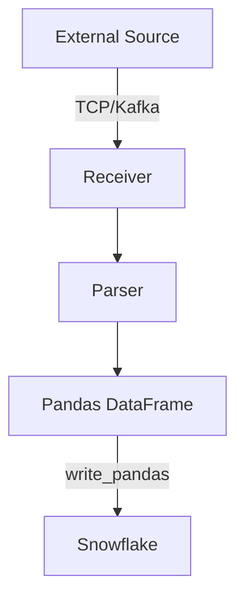

# 📄 ETL Pipeline with Kafka, Pandas, and Snowflake

This project implements an end-to-end ETL pipeline using **Kafka**, **Pandas**, and **Snowflake**.  
It demonstrates how data can be ingested from external sources via TCP or Kafka, transformed into Pandas DataFrames, and then loaded into Snowflake for further analysis.  
## 🔹 Architecture



## 🔹 Configuration

All configuration is managed through YAML file

### receiver section
Handles inbound log stream configuration.  

| Field    | Description                                | Example        |
|----------|--------------------------------------------|----------------|
| port     | Port to receive logs (TCP / Kafka broker)  | `19092`        |
| is-kafka | Use Kafka or TCP as receiver               | `true`         |
| kafka-ip | Kafka broker IP                            | `3.15.202.199` |
| topic    | Kafka topic for log events                 | `log-event`    |

---

### loader section
Handles Snowflake loader configuration.  

⚠️ **Security Note**: Access information (user-id, password, account) should **not** be committed to Git. Use environment variables or a secrets manager.  

| Field         | Description                                | Example             |
|---------------|--------------------------------------------|---------------------|
| user-id       | Snowflake user ID                          | `my_user`           |
| password      | Snowflake password                         | `password`          |
| account       | Snowflake account identifier               | `myaccount-xy123`   |
| batch-size    | Number of logs to accumulate before upload | `100`               |
| database-name | Target database in Snowflake               | `SNOWSIGHT`         |
| schema-name   | Target schema                              | `TESTSCHEMA`        |
| table-name    | Target table                               | `TESTTABLE`         |
| common-fields | Fields always included in log upload (CSV) | `product_name, product_version, event_id` |

---

## 🔹 Example `config.yaml`

```yaml
receiver:
  port: 19092
  is-kafka: true
  kafka-ip: 3.15.202.199
  topic: log-event

loader:
  ## TODO: Manage credentials securely (env vars, secrets manager)
  user-id: my_user
  password: my_password
  account: myaccount-xy123

  batch-size: 100

  database-name: SNOWSIGHT
  schema-name: TESTSCHEMA
  table-name: TESTTABLE
  common-fields: product_name, product_version, event_id
